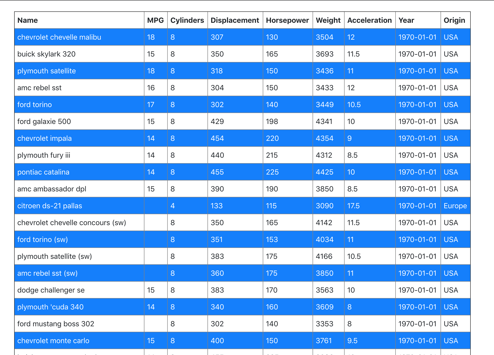

# Car Table

1. Finished list of cars is in `final` branch

### Create a table representing the data of the cars
1. App setup with `Create React App`
1. Use the data from the `https://gist.github.com/azizali/547cc17ab30693a5431c1a1e84fb3fd8`
1. Use Array.map to display the information in tabular form like in the image above
